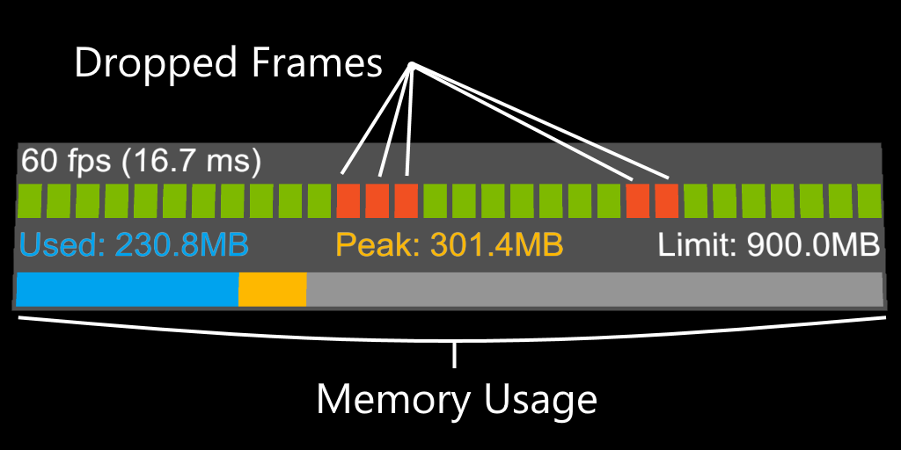
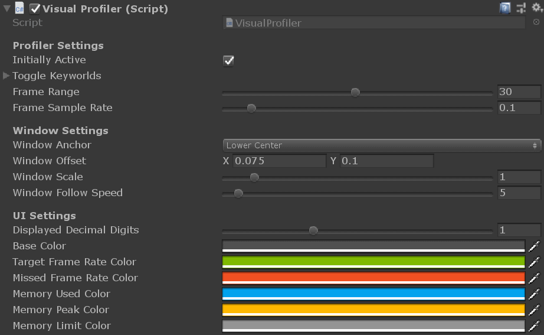

# Visual Profiler

The VisualProfiler provides a drop in, single file, solution for viewing your Windows Mixed Reality Unity application's frame rate and memory usage.

Dropped frames are displayed over time to visually find problem areas. Memory is reported as current, peak and max usage in a bar graph.

The Visual Profiler is targeted towards profiling 3D UWP Unity applications, and has been verified to work on the following platforms:

- Microsoft HoloLens
- Microsoft Immersive headsets (IHMD)
- Steam VR (HTC Vive / Oculus Rift)
- OpenXR platforms 

## Installation
Clone, or download, VisualProfiler.cs and place it anywhere within the Assets folder of your Unity project. 

Next add the VisualProfiler component to any gameobject in the Unity scene you wish to profile. The profiler is initially disabled (toggle-able via the initiallyActive property), but can be toggled via the enabled/disable voice commands keywords.

IMPORTANT: Please make sure to add the microphone capability to your app if you plan on using the enable/disable keywords, in Unity under Edit -> Project Settings -> Player -> Settings for Windows Store -> Publishing Settings -> Capabilities or in your Visual Studio Package.appxmanifest capabilities.

## Usage

When using the profiler look for "dropped frames" which appear as orange bars. Dropped frames indicate your application is not hitting its target frame rate and may need optimization work.

One should also keep an eye on the bottom memory bar to insure memory usage isn't rapidly changing or approaching the application's memory limit.

The profiler UI (such as color, text, and follow behavior) can also be tweaked in the component inspector.

# Feedback
To file issues or suggestions, please use the [Issues](https://github.com/Microsoft/VisualProfiler/issues) page for this project on GitHub.

# Contributing

This project welcomes contributions and suggestions.  Most contributions require you to agree to a
Contributor License Agreement (CLA) declaring that you have the right to, and actually do, grant us
the rights to use your contribution. For details, visit https://cla.microsoft.com.

When you submit a pull request, a CLA-bot will automatically determine whether you need to provide
a CLA and decorate the PR appropriately (e.g., label, comment). Simply follow the instructions
provided by the bot. You will only need to do this once across all repos using our CLA.

This project has adopted the [Microsoft Open Source Code of Conduct](https://opensource.microsoft.com/codeofconduct/).
For more information see the [Code of Conduct FAQ](https://opensource.microsoft.com/codeofconduct/faq/) or
contact [opencode@microsoft.com](mailto:opencode@microsoft.com) with any additional questions or comments.
